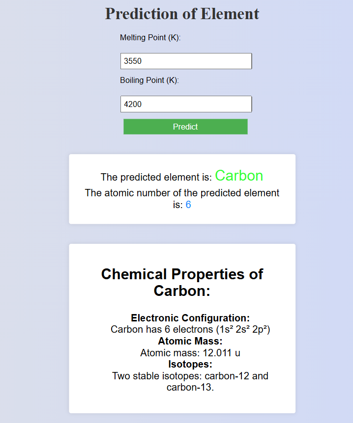

# Element Prediction Project

This project is a Machine Learning web application built with Flask that predicts a chemical element based on its Melting Point and Boiling Point. It uses an interactive web interface where users can input these thermodynamic properties to discover the corresponding element and its atomic number.

<div style="text-align:center">
	
	
</div>
## Features

- **Interactive Web Interface:** A user-friendly web page for submitting data.
- **Machine Learning Inference:** Automatically scales the inputs and uses a trained classification model to inference the exact chemical element.
- **REST API Endpoint:** Processes predictions asynchronously via a backend JSON endpoint.
- **Dual Model Implementation:** Includes a Random Forest Classifier (used by the web app) and an alternative Artificial Neural Network (MLPClassifier) implementation.

## Tech Stack

- **Backend:** Python, Flask
- **Machine Learning:** Scikit-learn (RandomForestClassifier, MLPClassifier), Pandas, NumPy
- **Frontend:** HTML, CSS, JavaScript

## Project Structure

```text
.
├── app.py             # Main Flask application and Random Forest model pipeline
├── text.py            # Experimental script using an Artificial Neural Network (MLPClassifier)
├── elements.csv       # Dataset containing element properties
├── static/            # Static assets (images, CSS styles)
├── templates/         # HTML templates (index.html)
└── README.md          # Project documentation
```

## Dataset

The dataset (`elements.csv`) contains the following key columns:

- `Element`: Name of the chemical element (Target Variable).
- `Atomic Number`: Atomic number of the element.
- `Melting Point(K)`: Melting point in Kelvin.
- `Boiling Point (K)`: Boiling point in Kelvin.

_Note: Missing values (represented as `-`) in the dataset are automatically handled during data preprocessing._

## Installation and Setup

1. **Clone the repository or download the source code.**
2. **Ensure Python is installed** (Create a virtual environment if preferred).
3. **Install the required dependencies:**
   You will need `flask`, `pandas`, `numpy`, and `scikit-learn`.
   ```bash
   pip install flask pandas numpy scikit-learn
   ```

## Usage

### Running the Web Application

1. Start the Flask server by running:
   ```bash
   python app.py
   ```
2. Open your web browser and navigate to `http://127.0.0.1:5000/`.
3. Enter the Melting Point (in Kelvin) and Boiling Point (in Kelvin).
4. Click submit to see the predicted element and its atomic number.

### Running the ANN Script (Command Line)

If you want to test the multi-layer perceptron (ANN) model interactively in your terminal:

```bash
python text.py
```

This script will output the training and testing scores of the model and prompt you for melting and boiling point inputs within the terminal.

## How It Works

1. **Data Preprocessing:** The application loads the dataset, cleans missing values (fills NaNs with the median), and standardizes the features using `StandardScaler`.
2. **Model Training:**
   - The main app (`app.py`) trains a `RandomForestClassifier` locally during initialization.
   - `text.py` trains an `MLPClassifier`.
3. **Prediction:** When the user supplies data via the frontend, the inputs are scaled using the same `StandardScaler` properties and passed into the prediction model to yield the likely element.
